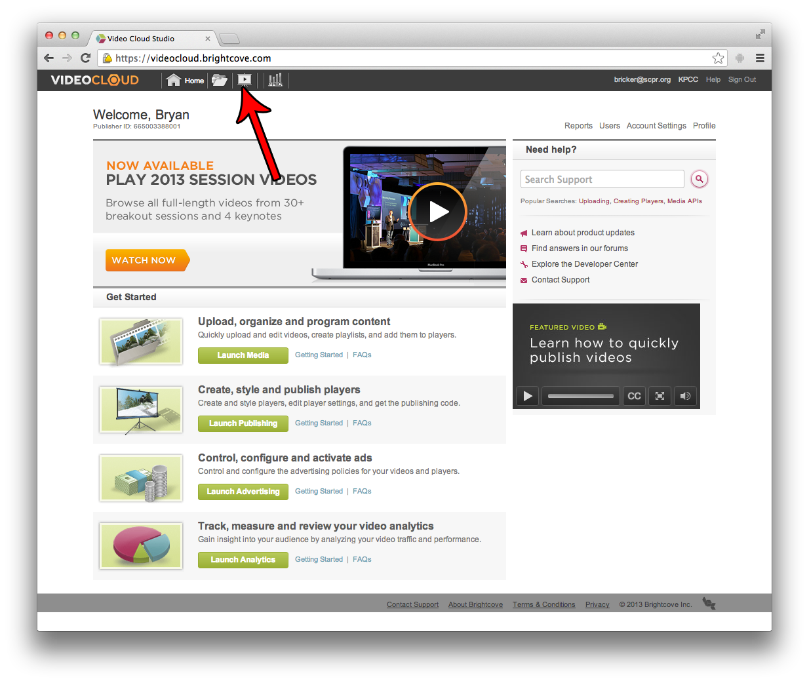
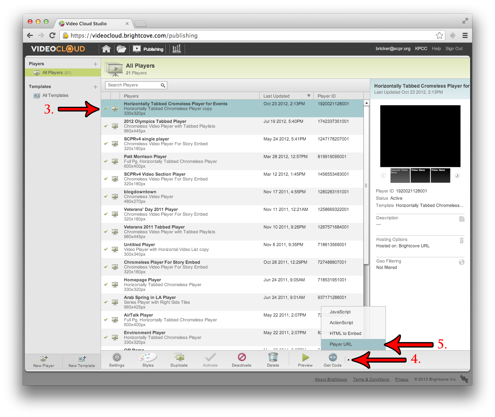
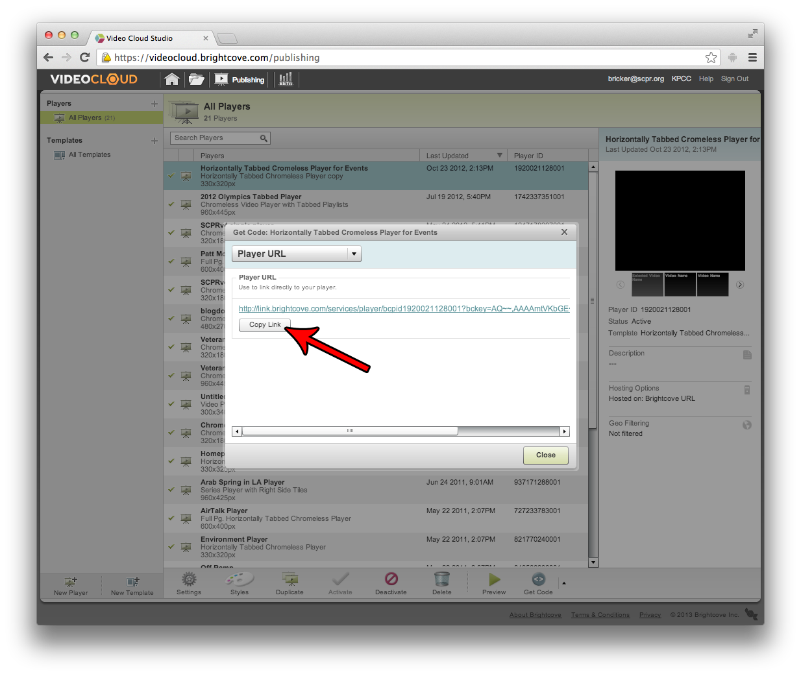

## Brightcove

You may only embed a Player, not individual Videos. So, in order to embed a Video, you'll need to create a Player and add your Video to it. That process is outside of the scope of this tutorial.

Once the Player is created, follow these steps:

1. Login to Brightcove's "Video Cloud".  

2. Click the "Publishing" link (the thing that looks like a projector or something)  

3. Select the Player that you wish to embed.
4. Click the arrow next to the "Get Code" button on the bottom of the page.
5. Select "Player URL"  

6. In the pop-up dialog, click the "Copy Link" button. The correct URL will be copied to your clipboard.  

