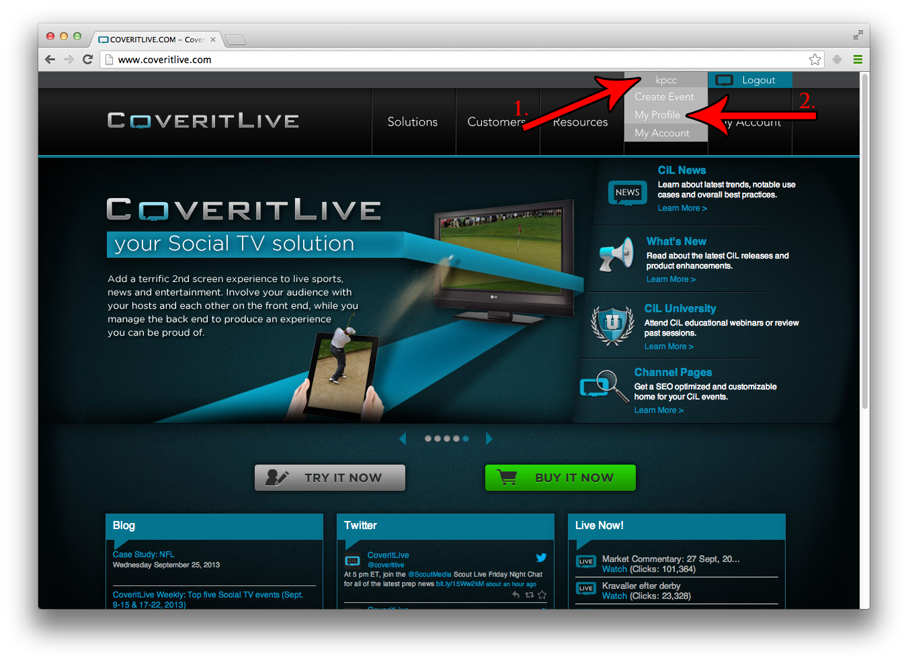
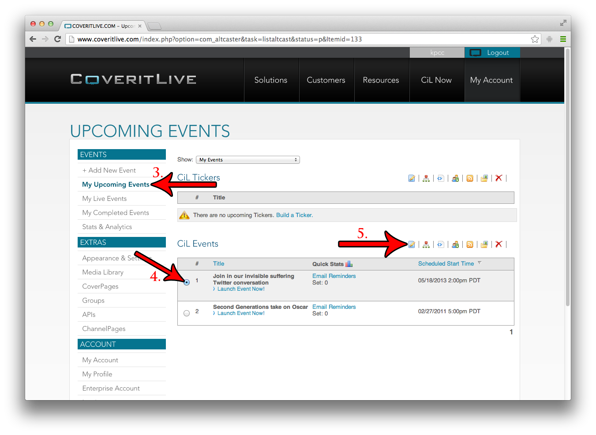
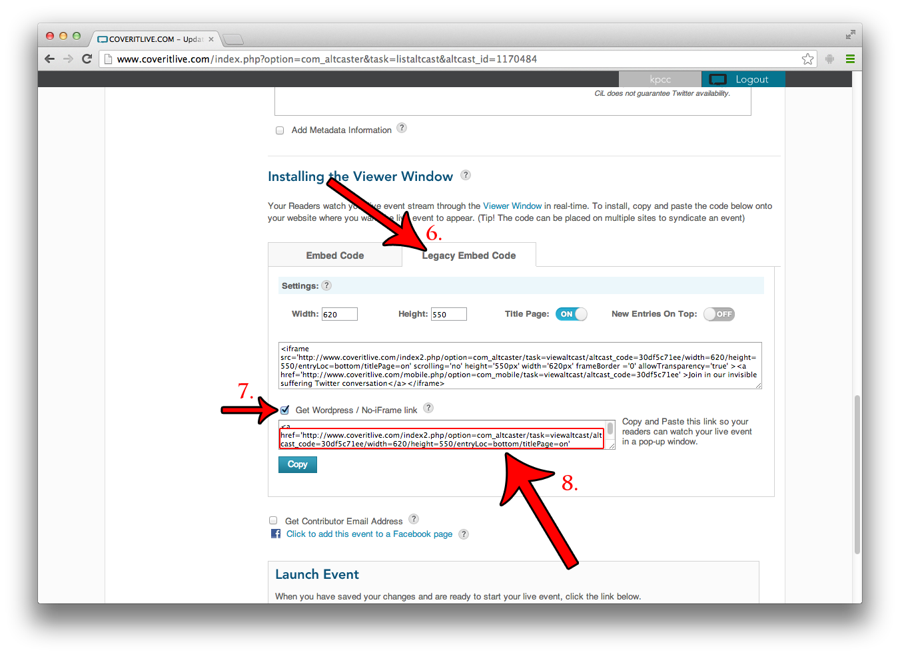

## Cover It Live

**NOTE**: Cover It Live doesn't have an official oEmbed endpoint. The method described
in this document is dependent on the client-side code at KPCC.org for swapping Cover It Live embeds.

1. Login to Cover It Live.
2. Navigate to your profile. If you're still on the homepage, click your username in the top right of the page, and then click "My Profile."  

3. Go to a list of Live or Upcoming Events.
4. Select the event which you wish to embed.
5. Click the blue "Edit" icon (see image):  

6. From the Edit page, scroll down to "Installing the Viewer Window", and open the "Legacy Embed Code" tab. Don't worry, we're still going to use the NEW embed — we just need this legacy code to get the URL.
7. Check the "Get Wordpress / No-iFrame link" box. A text area will appear.
8. Use the URL inside of that text area as your oEmbed URL. You may need to copy the full contents of the text area (full A tag) into another document, and then extract the URL from there. Remember, you only want the URL, not the full tag.  

