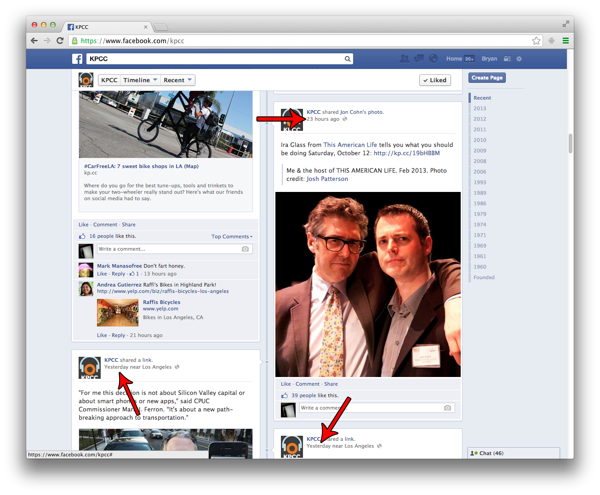
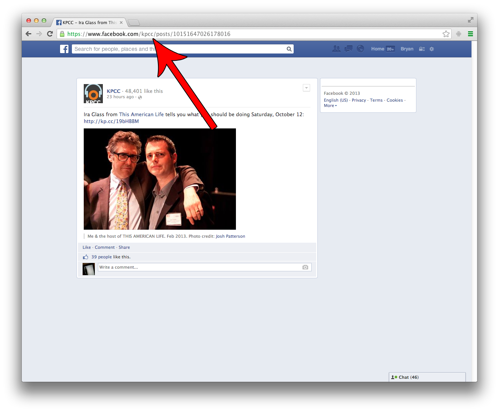

## Facebook

1. Go to a friend's page, your wall, news feed, or anywhere with a list of posts. (Example: http://facebook.com/kpcc)
2. Click on the Timestamp for the post you wish to embed.  

3. Use that URL as the oEmbed URL.

The correct URL for the following post is `https://www.facebook.com/kpcc/posts/10151647026178016`.

