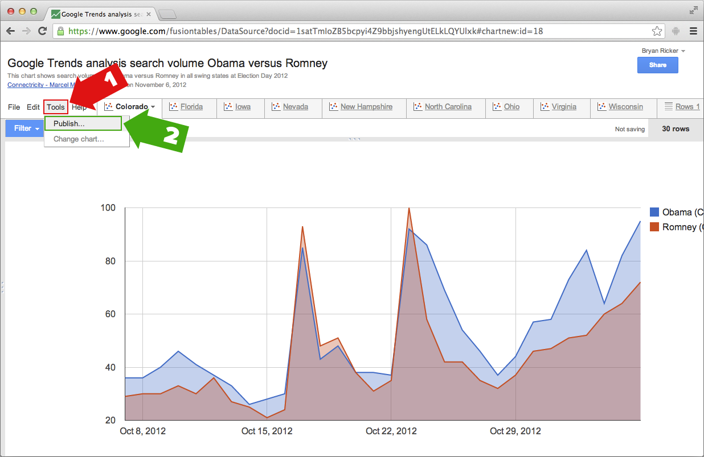

## Google Fusion

1. Visit the page for the Fusion table/map you wish to embed.
   Click "Tools" in the menu bar.
2. Click the "Publish" open from the drop-down.
  
3. A pop-up will appear. Select the FIRST text field, containing the sharable
   URL. This is your oEmbed URL.

The correct URL for the following map is `https://www.google.com/fusiontables/embedviz?containerId=gviz_canvas&q=select+col0%2C+col11%2C+col12+from+1satTmIoZB5bcpyi4Z9bbjshyengUtELkLQYUlxk+order+by+col0+asc&viz=GVIZ&t=AREA&rmax=250&uiversion=2&gco_forceIFrame=true&gco_hasLabelsColumn=true&gco_type=area&width=500&height=300`.

