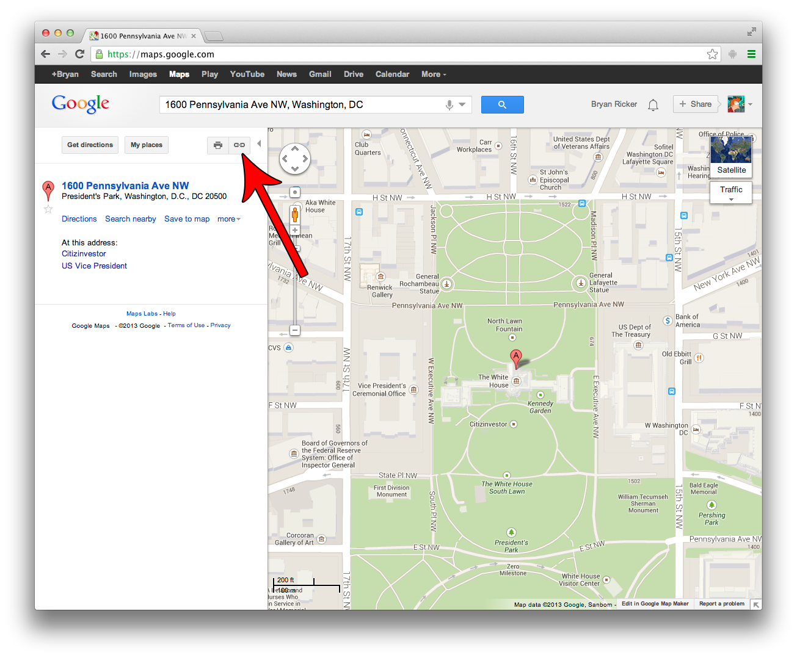
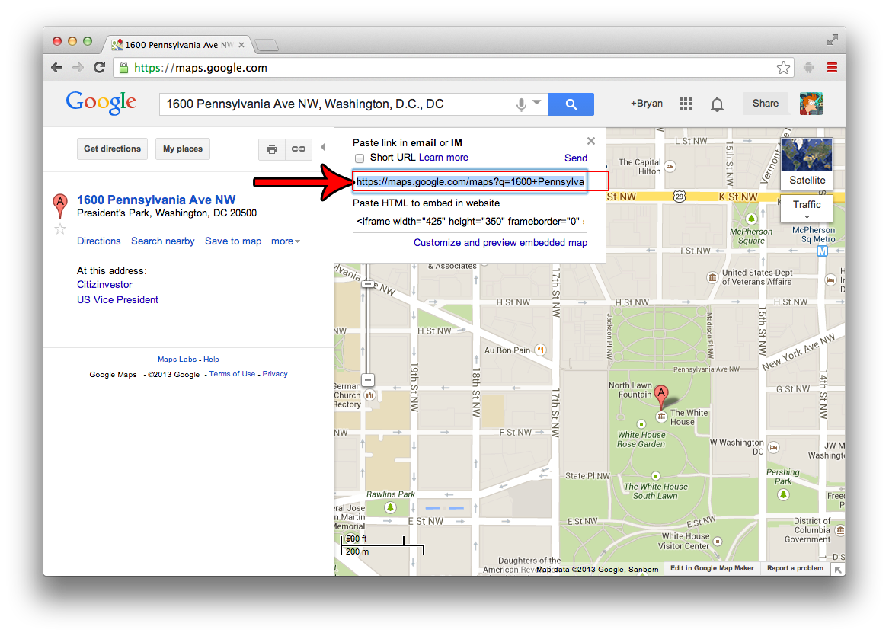

## Google Maps

**Note** This method will not work with the "New" Google Maps. You must use the
"Classic" Google Maps for these instructions, for now.

1. Visit http://maps.google.com
2. Type in the address/location you want to embed.
3. Click the LINK icon:  

4. A small pop-up will appear. Use the provided URL as the oEmbed URL.

The correct URL for the following map is `https://maps.google.com/maps?q=1600+Pennsylvania+Ave+NW,+Washington,+D.C.,+DC&hl=en&ll=38.899082,-77.038493&spn=0.009869,0.01442&sll=37.269174,-119.306607&sspn=12.963384,18.808594&oq=1600+Pen&hnear=1600+Pennsylvania+Ave+NW,+Washington,+District+of+Columbia+20500&t=m&z=16`.

