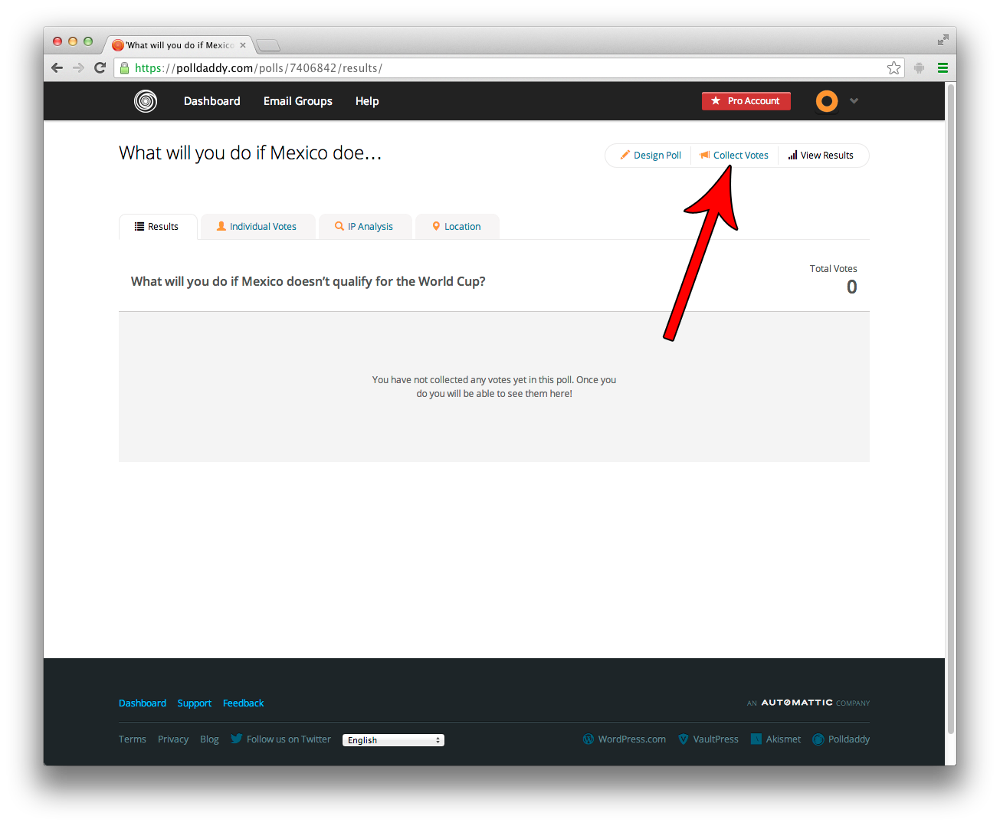
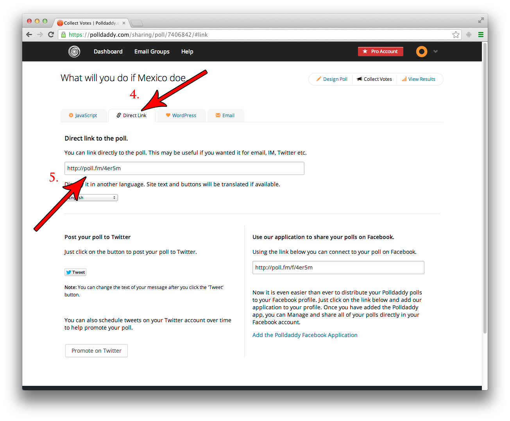

## Polldaddy

1. Login to Polldaddy at http://polldaddy.com.
2. On any list of Polls, Surveys, Quizzes, etc., click the Title of the poll which you wish to embed.  

3. Click on "Collect Votes" near the top.  

4. Click on the "Direct Link" tab.
5. Use the provided URL as the oEmbed URL.

The correct URL for this poll is `http://poll.fm/4er5m`

