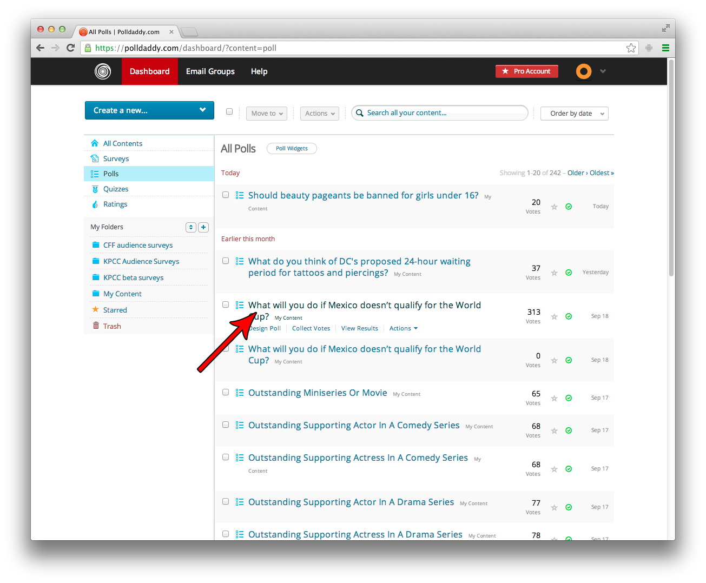

## Polldaddy

### Polls

1. Login to Polldaddy at http://polldaddy.com.
2. On any list of Polls, Surveys, Quizzes, etc., click the Title of the poll which you wish to embed.  

3. Click on "Collect Votes" near the top.  

4. Click on the "Direct Link" tab.
5. Visit the provided URL. **NOTE** The provided URL is *not* the oEmbed URL.  

6. The short URL will redirect to the full URL. That is your oEmbed URL.

The correct URL for the following poll is `http://polldaddy.com/poll/7406842/`.

### Surveys

Surveys are basically the same as Polls, but the "Direct Link" tab is in a different position (don't worry, just follow the above steps and you will see it).
