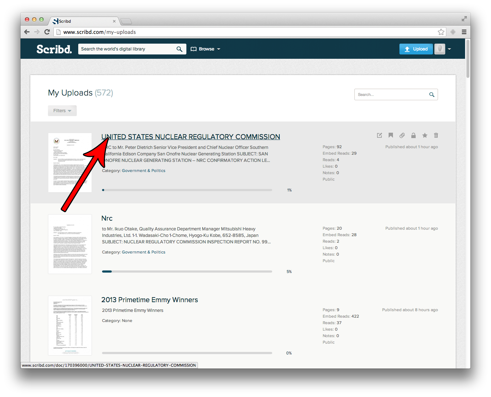

## Scribd

1. Log into Scribd, and click the Profile button in the top right.  

2. Click on "My Uploads" to see a list of all of your uploaded Documents, or go to another list of documents.
3. Click on the title of the document which you wish to embed.  

4. Use that URL as the oEmbed URL.

The correct URL for the following document is `http://www.scribd.com/doc/170396000/UNITED-STATES-NUCLEAR-REGULATORY-COMMISSION`.

### Alternate Method

If you see the document embedded on a website, but do not want to upload it yourself, follow these steps:

1. Locate the document, and click the "EMBED" link near the bottom.  

2. Click the "COPY" button to copy the URL for the document. This URL is your oEmbed URL.
