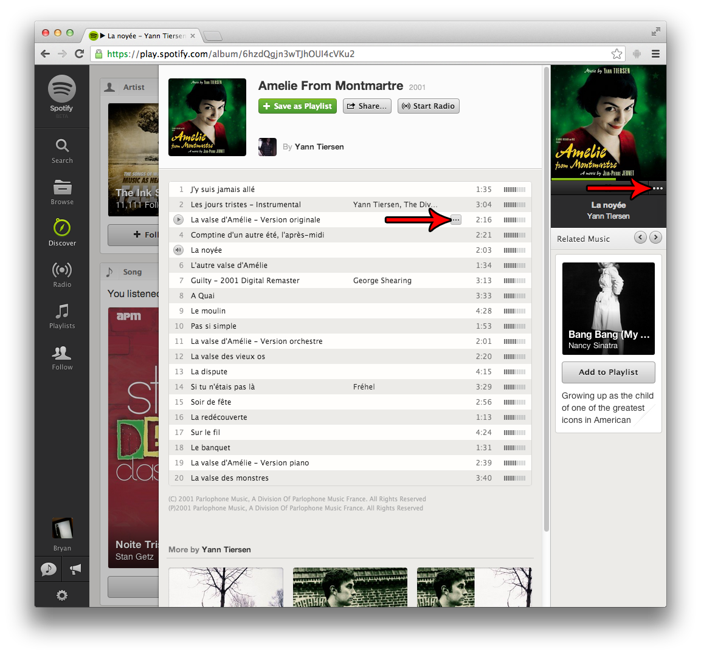
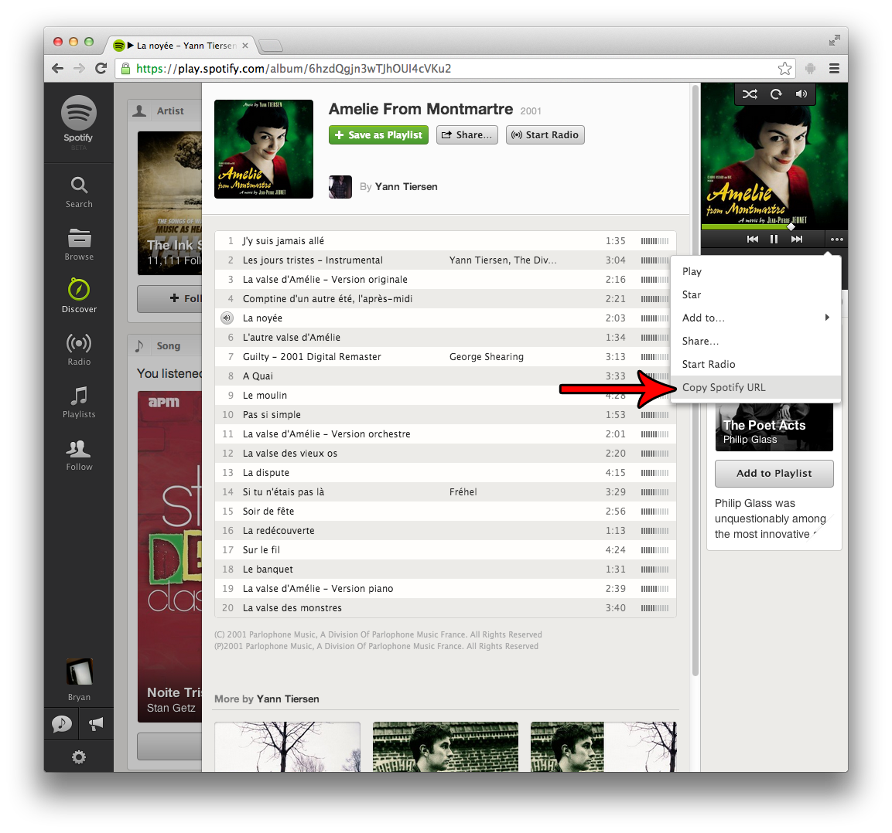
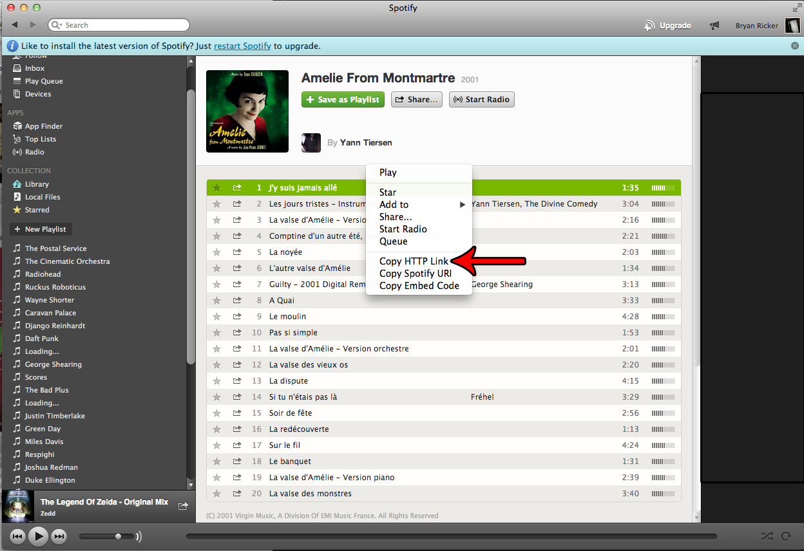
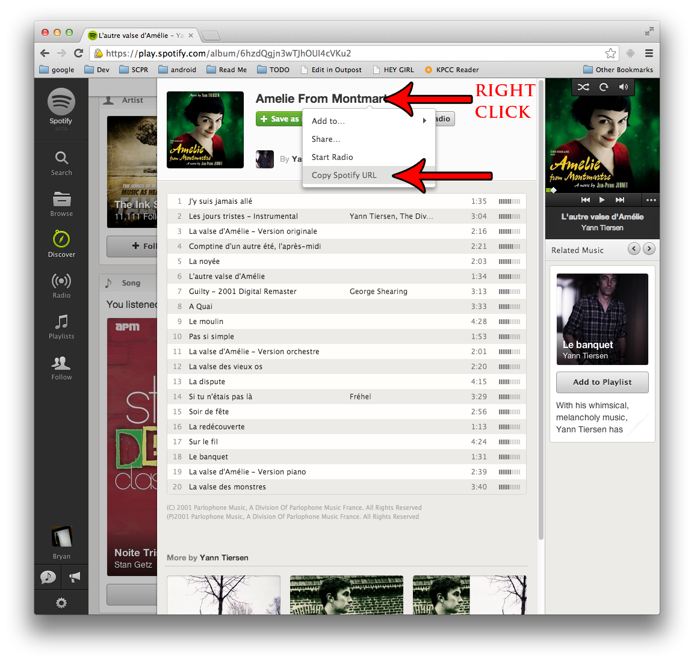

## Spotify

### Web App (spotify.com)

1. Find the song you wish to embed.
2. Click the "three dots" icon.  

3. Click the "Copy Spotify URL" link. The correct URL will be copied to your clipboard.  

### Native App (Mac/Windows)

1. Find the song you wish to embed.
2. Right-click the song and click the "Copy HTTP Link" option.  

3. The correct URL will be copied to your clipboard.

### Embedding albums or playlists

This works exactly the same way as embedding a single song, except instead of clicking the "three dots" icon, you should right-click the album/playlist title.

Alternatively, you can simply copy the page's current URL when you are viewing an album or playlist.

