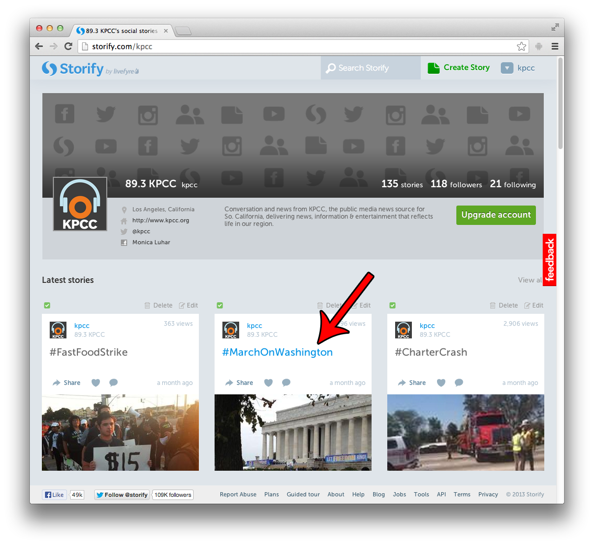
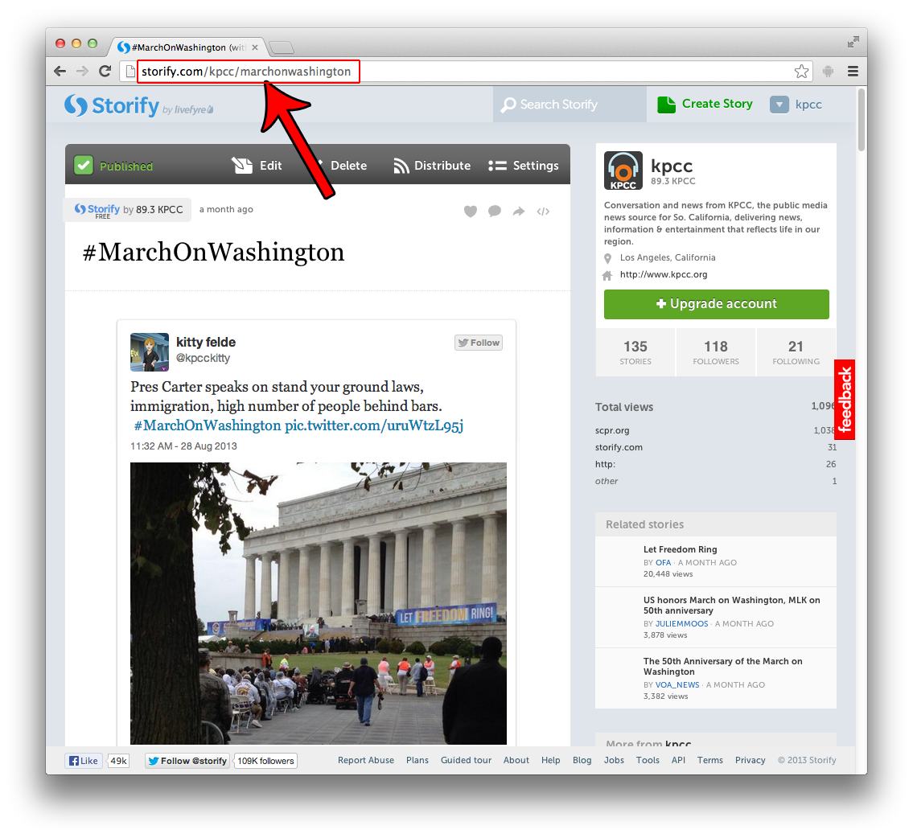

## Storify

1. Login to Storify.
2. Click anywhere, on any Story. Generally, hash tags or titles are good targets.  

3. Use that URL are your oEmbed URL.

The correct URL for this story is `http://storify.com/kpcc/marchonwashington`.

