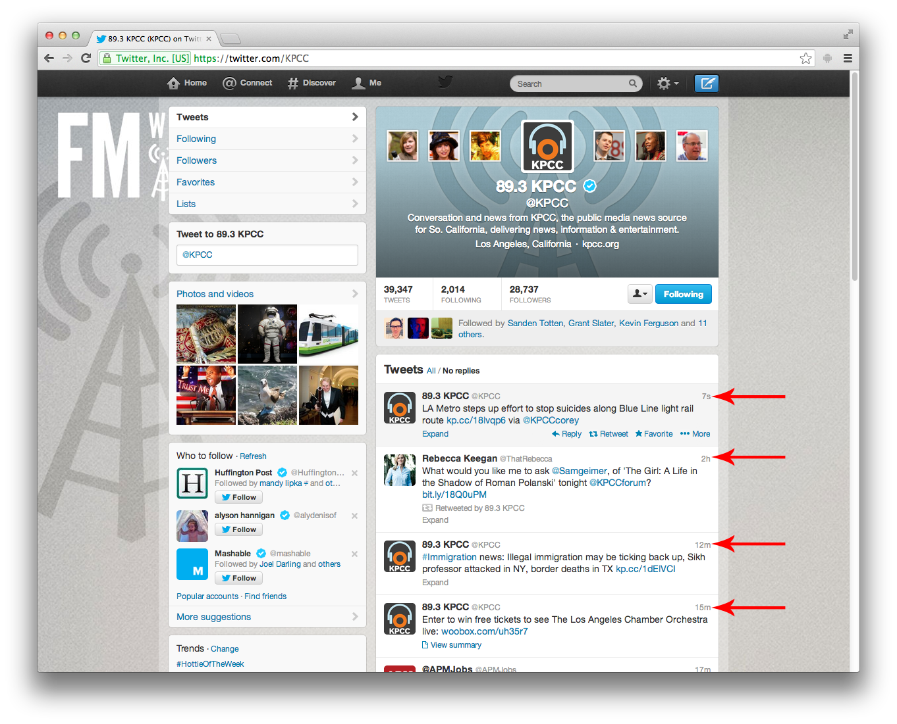
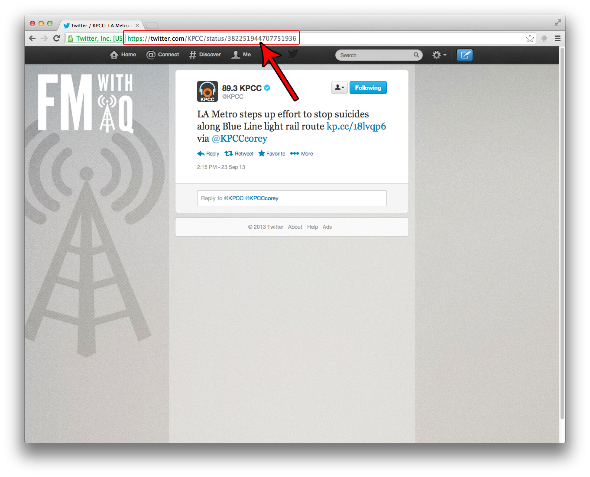

## Twitter

1. On any twitter feed, click on the relative timestamp (7h, 5m, etc.) of a tweet.  

2. Use that URL as the oEmbed URL.

The correct URL for the following tweet is `https://twitter.com/KPCC/status/382251944707751936`.

