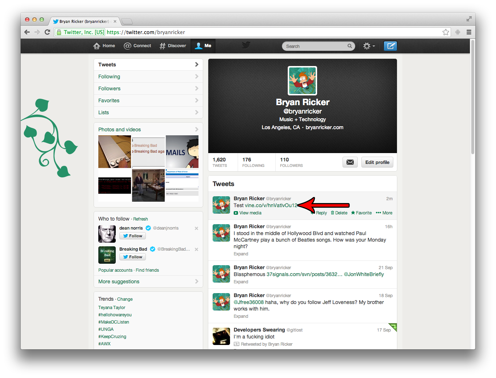
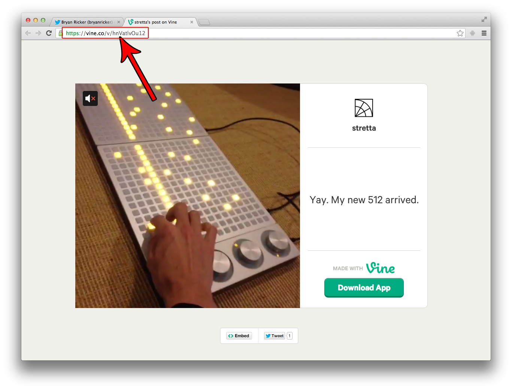

## Vine

You'll need to get to the Vine video by clicking on it from somewhere, since you can't "search" for or find a Vine video from the official Vine website. The best way to access the video in your browser is:

1. Tweet the video **from your mobile Vine application**.
2. Visit your Twitter feed in your browser.
3. Click the `vine.co` link to the video you just tweeted.  

4. Use that URL as the oEmbed URL.

